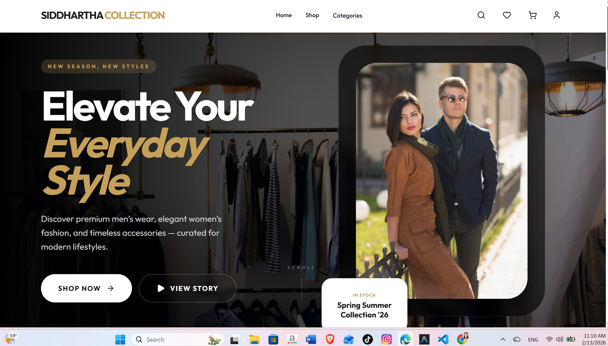
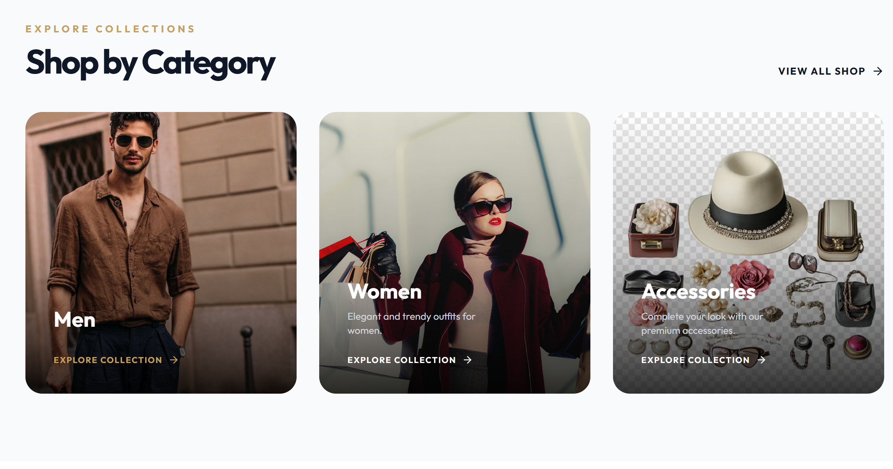
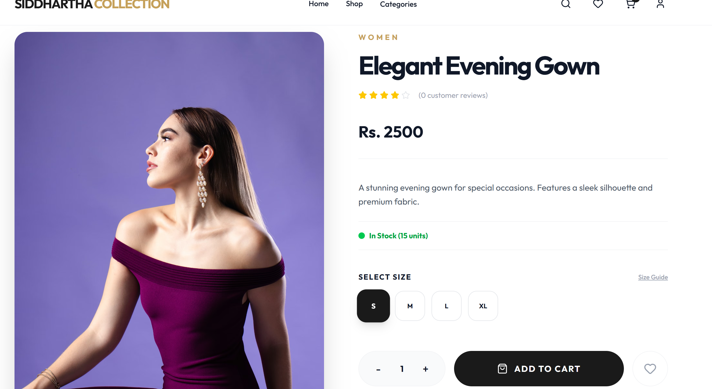
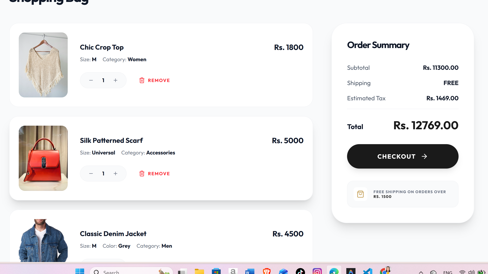

# 👗 Siddhartha Collection  
### Premium Fashion E-Commerce Platform (MERN Stack)

**Siddhartha Collection** is a full-stack, production-ready e-commerce application developed for a modern fashion and clothing brand.  
The platform delivers a premium shopping experience with a clean UI, secure authentication, and scalable backend architecture using the MERN stack.

---

## ✨ Key Features

### 🎨 User Experience
- **Modern UI**: Minimalist and premium design aesthetics.
- **Responsive**: Fully optimized for mobile, tablet, and desktop devices.
- **Animations**: Smooth transitions and micro-interactions using Framer Motion.

### 🔐 Authentication & Security
- **JWT Auth**: Secure Access & Refresh token system.
- **Password Hashing**: Industry-standard encryption with BcryptJS.
- **Protected Routes**: Secure access to profile, cart, and checkout.

### 🛍️ Product & Shopping
- **Smart Filtering**: Browse by categories (Men, Women, Accessories).
- **Search & Sort**: Powerful search bar and price/newest sorting.
- **Rich Details**: High-quality image displays and detailed descriptions.

### 🛒 Cart & Wishlist
- **Persistent State**: Items remain in your cart/wishlist even after page refresh.
- **Seamless Sync**: Synchronized across the application using React Context API.

### 💳 Payments & Orders
- **eSewa Integration**: Secure digital payment gateway (Sandbox mode).
- **Cash on Delivery**: Traditional payment option supported.
- **Checkout Flow**: Multi-step process with shipping address validation.
- **Order History**: Track past orders and payment statuses.

### 👤 User Profile
- **Personal Dashboard**: Manage account details and view order status.

## 📸 Screenshots

### 🏠 Home Page


### 🛍️ Product Listing


### 👗 Product Details


### 🛒 Cart


### 🚚 Checkout


---

## 🛠️ Technology Stack

| Layer | Technology |
|---|---|
| **Frontend** | React.js (Vite), Tailwind CSS 4, Framer Motion, Lucide React |
| **Backend** | Node.js, Express.js |
| **Database** | MongoDB Atlas, Mongoose ODM |
| **Auth** | JSON Web Tokens (JWT), BcryptJS |
| **Payment** | eSewa SDK |

---

## 🚀 Getting Started

### Prerequisites
- Node.js (v18 or later)
- MongoDB Atlas account

### 🔐 Environment Configuration

Create a `.env` file inside the `server` directory:

```env
PORT=5000
MONGODB_URI=your_mongodb_connection_string
JWT_SECRET=your_jwt_secret
JWT_REFRESH_SECRET=your_refresh_token_secret
FRONTEND_URL=http://localhost:5173

# eSewa Config (Test Credentials)
ESEWA_SECRET_KEY=8gBm/:&EnhH.1/q
ESEWA_PRODUCT_CODE=EPAYTEST
```

### ⚙️ Installation & Running

1️⃣ **Install everything** (Root, Client, and Server):
```bash
npm run install-all
```

2️⃣ **Seed the database**:
```bash
npm run seed
```

3️⃣ **Start the application**:
```bash
npm run dev
```
*This command runs both the frontend (Port 5173) and backend (Port 5000) concurrently.*

---

## 📂 Project Structure

```text
Ecommerce/
├── client/             # React Frontend
│   ├── src/
│   │   ├── components/ # Reusable UI components
│   │   ├── pages/      # Route pages
│   │   └── context/    # State management
├── server/             # Node & Express Backend
│   ├── models/         # Mongoose schemas
│   ├── routes/         # API endpoints
│   ├── controllers/    # Business logic
│   └── middleware/     # Auth & validation
├── package.json        # Root script orchestration
└── README.md
```

---

## 🔮 Future Enhancements
- [ ] Admin Dashboard for inventory & order management
- [ ] Integration with Khalti & Stripe
- [ ] User product reviews & ratings
- [ ] Real-time order tracking notifications
- [ ] AI-based product recommendations

---


## 📜 License
This project is licensed under the MIT License — free to use, modify, and distribute.
